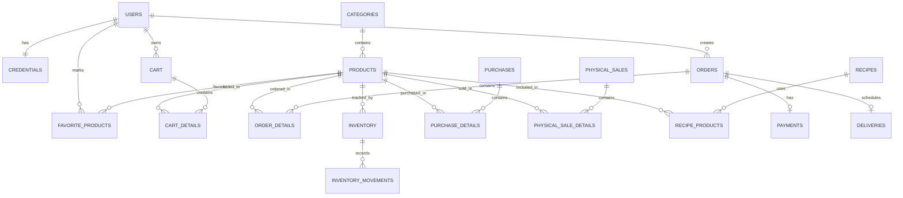

# La Rueda Market

La Rueda Market es una plataforma web desarrollada como Producto Mínimo Viable (PMV) para apoyar la operación comercial y administrativa de un supermercado rural.

El sistema permite que los clientes consulten productos, agreguen productos al carrito, creen pedidos, registren pagos, consulten recetas recomendadas y marquen productos como favoritos. Desde el panel administrativo permite gestionar productos, categorías, usuarios, pedidos, pagos, domicilios, inventario, compras, ventas físicas, gastos, caja diaria, traslados a banco e informes de apoyo contable.

El objetivo del proyecto es ser una herramienta operativa para vender, organizar pedidos, controlar inventario, registrar ingresos y egresos, y apoyar la administración diaria de La Rueda Market.

---

## Estado del proyecto

El sistema se encuentra desplegado en producción.

- Frontend: https://la-rueda-market.vercel.app
- Backend API: https://la-rueda-market.onrender.com/api
- Swagger: https://la-rueda-market.onrender.com/api/docs
- Repositorio: https://github.com/Elena-0718/La-Rueda-Market.git

---

## Flujo principal

```text
Cliente
  ↓
Catálogo de productos
  ↓
Carrito de compras
  ↓
Pedido
  ↓
Pago
  ↓
Entrega o recogida en tienda
```

Flujo administrativo:

```text
Productos
  ↓
Inventario
  ↓
Compras / Ventas físicas
  ↓
Gastos / Caja diaria
  ↓
Informe financiero e informe para contador
```

---

## Tecnologías utilizadas

### Backend

- Node.js
- NestJS
- TypeScript
- PostgreSQL
- TypeORM
- JWT
- Swagger

### Frontend

- React
- Vite
- Tailwind CSS
- Axios
- React Router DOM

### Despliegue y herramientas

- Git
- GitHub
- Render
- Vercel
- Supabase PostgreSQL
- Visual Studio Code

---

## Estructura general del proyecto

```text
La-Rueda-Market
│
├── backend
│   └── src
│       ├── auth
│       ├── users
│       ├── credentials
│       ├── products
│       ├── categories
│       ├── cart
│       ├── orders
│       ├── payments
│       ├── deliveries
│       ├── inventory
│       ├── inventory-movement
│       ├── recipes
│       ├── favorite-products
│       ├── expenses
│       ├── purchases
│       ├── physical-sales
│       ├── cash-closings
│       ├── cash-deposits
│       ├── financial-report
│       └── entities
│
├── frontend
│   └── src
│       ├── api
│       ├── components
│       ├── features
│       ├── layouts
│       ├── pages
│       └── routes
│
├── docs
├── README.md
├── .gitignore
└── LICENSE
```

---

## Módulos del cliente

- Registro e inicio de sesión.
- Catálogo de productos.
- Búsqueda de productos.
- Filtros por categoría.
- Carrito de compras.
- Creación de pedidos.
- Selección de entrega:
  - Recoger en tienda.
  - Domicilio programado.
- Registro de pago:
  - Efectivo.
  - Transferencia.
- Consulta de pedidos.
- Consulta de recetas.
- Productos recomendados desde recetas.
- Productos favoritos.

---

## Módulos administrativos

- Gestión de usuarios.
- Gestión de productos.
- Gestión de categorías.
- Gestión de pedidos.
- Consulta de detalle de pedidos.
- Confirmación y rechazo de pagos.
- Gestión de domicilios.
- Control de inventario.
- Movimientos de inventario.
- Registro de compras.
- Registro de ventas físicas.
- Registro de gastos.
- Caja diaria.
- Traslados a banco o billeteras.
- Informe financiero.
- Informe para contador.
- Gestión de recetas.

---

## Reglas principales del negocio

- Los productos activos se muestran en el catálogo del cliente.
- Los pedidos programados pueden recibirse aunque no exista stock físico inmediato.
- Las ventas físicas sí requieren inventario disponible.
- Las compras tipo inventario aumentan el stock físico.
- Las compras para pedido programado registran costo, pero no aumentan inventario físico.
- Las ventas físicas descuentan inventario.
- Los pedidos descuentan inventario solo cuando se marcan como entregados y el producto tiene control de stock.
- La caja diaria controla únicamente efectivo físico.
- Los pagos por transferencia o billetera se validan con el soporte o movimiento externo correspondiente.


---

## Roles actuales

### CLIENT

Rol asignado al cliente de la tienda.

Puede:

- Consultar productos.
- Crear pedidos.
- Registrar pagos.
- Consultar sus pedidos.
- Usar el carrito.
- Ver recetas.
- Marcar productos favoritos.

### ADMIN

Rol asignado al administrador principal.

Puede gestionar los módulos administrativos del sistema:

- Productos.
- Categorías.
- Usuarios.
- Pedidos.
- Pagos.
- Domicilios.
- Inventario.
- Compras.
- Ventas físicas.
- Gastos.
- Caja.
- Informes.
- Recetas.

---

## Mejoras futuras

### Roles operativos

Se plantea agregar roles con permisos limitados cuando el sistema esté operando con usuarios reales:

- `SELLER`: para registrar ventas físicas, consultar inventario operativo y realizar cierres de caja.
- `DELIVERY`: para consultar pedidos por entregar, ver detalle del pedido y marcar entregas.

### Nómina

Se plantea crear un módulo para registrar pagos de personal, turnos, pagos temporales y costos laborales asociados a la operación.

### Beneficios por cliente frecuente

Se plantea crear un módulo para identificar clientes frecuentes según sus compras acumuladas y asignar descuentos administrados por La Rueda Market.

```text
Cliente con compras acumuladas
  ↓
Administrador revisa elegibilidad
  ↓
Administrador asigna beneficio
  ↓
Cliente aplica descuento en un pedido
```


---

## Diagrama relacional simplificado



---

## Instalación local

### Clonar el repositorio

```bash
git clone https://github.com/Elena-0718/La-Rueda-Market.git
cd La-Rueda-Market
```

---

## Backend

### Instalar dependencias

```bash
cd backend
npm install
```

### Variables de entorno

Crear un archivo `.env.development` o `.env` dentro de la carpeta `backend`.

```env
DB_HOST=localhost
DB_PORT=5432
DB_USERNAME=postgres
DB_PASSWORD=tu_password
DB_NAME=la_rueda_market

JWT_SECRET=tu_clave_secreta
JWT_EXPIRES_IN=1d
```

### Ejecutar backend

```bash
npm run start:dev
```

API local:

```text
http://localhost:3000/api
```

Swagger local:

```text
http://localhost:3000/api/docs
```

---

## Frontend

### Instalar dependencias

```bash
cd frontend
npm install
```

### Variables de entorno

Crear un archivo `.env` dentro de la carpeta `frontend`.

```env
VITE_API_URL=http://localhost:3000/api
```

Para producción:

```env
VITE_API_URL=https://la-rueda-market.onrender.com/api
```

### Ejecutar frontend

```bash
npm run dev
```

Frontend local:

```text
http://localhost:5173
```

---

## Build de producción

### Backend

```bash
cd backend
npm run build
npm run start:prod
```

### Frontend

```bash
cd frontend
npm run build
npm run preview
```

Preview local:

```text
http://localhost:4173
```

---

## Actualizar GitHub

```bash
git status
git add README.md
git commit -m "Update project README"
git push origin main
```

---

## Alcance actual

La Rueda Market es un sistema de gestión operativa para apoyar ventas, pedidos, pagos, inventario, compras, ventas físicas, gastos, caja diaria e informes básicos.


---

## Autora

Nórida Elena Rueda Peña  
Análisis y Desarrollo de Software - ADSO  
SENA

